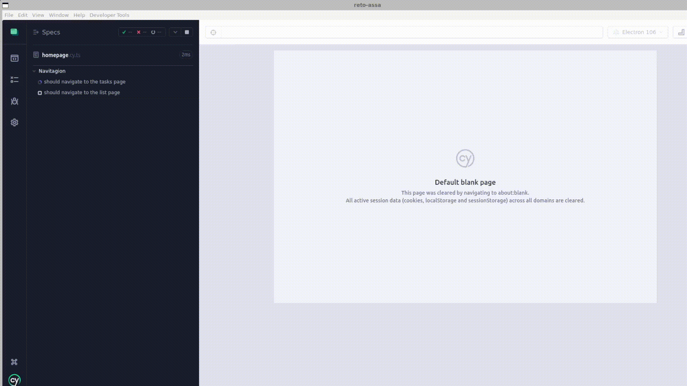

<h1 align="center">Reto ASSA</h1>

## Introducción

Esta es una aplicación web creada con el Framework de Next.js y React. Utilizando el lenguaje de programación TypeScript.

## Build/Run

### Requirements

- [Node.js 18.16.0 LTS](https://nodejs.org)
- [yarn](https://yarnpkg.com)

_Estas dependencias son de uso gratuito._

### Configuración del entorno de desarrollo local

Antes de iniciar el proyecto es necesario instalar las dependencias necesarias para el que la aplicación web funcione.

- Cypress
<p align="center">
  
</p>

```

## Autor

👤 **Brian Chavarría**

- Twitter: [@bayyan_d](https://twitter.com/bayyan_d)
- Github: [@bayyand](https://github.com/bayyand)
- Linked**In**: [@bayyand](https://www.linkedin.com/in/bayyand)
```
